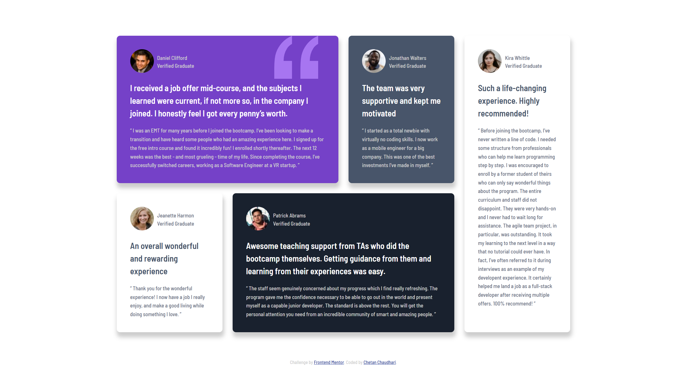

Frontend Mentor – Testimonials Grid Section Solution

A responsive Testimonials Grid Section built using HTML and CSS, based on the Frontend Mentor challenge. This project focuses on mastering CSS Grid layouts, responsive design, and clean, maintainable styling.

📸 Screenshot

🔗 Links

Live Site: https://your-live-site-url.com

Solution URL: https://www.frontendmentor.io/solutions/your-solution-link

🛠 Tech Stack

HTML5 – Semantic markup

CSS3 – Grid, Flexbox, custom properties

Desktop-first workflow

✨ Features

Responsive testimonial grid layout

CSS Grid–based positioning with column and row spans

Clean, modern UI matching the design specification

Reusable CSS variables for colors and typography

📐 Layout & Responsiveness

CSS Grid used for the overall testimonial layout

Cards span multiple rows and columns as per the design

Flexbox used for internal card alignment (author info)

Media queries ensure proper stacking on smaller screens

♿ Accessibility Improvements

Semantic HTML structure

Descriptive alt text for images

Readable font sizes and line heights

High-contrast text for better readability

🧠 What I Learned

Creating complex layouts using CSS Grid spans

Managing uneven card heights without breaking layout

Combining Grid + Flexbox effectively

Structuring CSS using custom properties for scalability

🚀 Future Enhancements

Add hover and focus states for testimonial cards

Improve keyboard navigation

Add subtle animations for enhanced UX

Refine responsive breakpoints for tablets

📂 Project Structure
testimonials-grid-section/
│── images/
│── design/
│── index.html
│── styles.css
│── README.md
│── style-guide.md

👤 Author

Chetan Chaudhari

GitHub: https://github.com/Chetan-Chaudhari

Frontend Mentor: https://www.frontendmentor.io/profile/yourusername

🙏 Acknowledgements

Frontend Mentor
for the challenge and design assets

⭐ If you like this project, feel free to give it a star!
